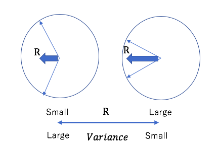
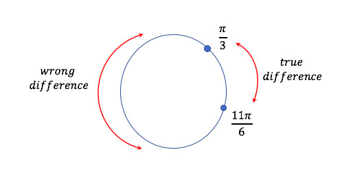
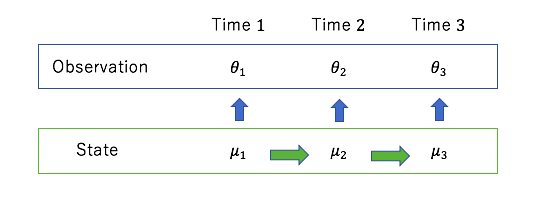
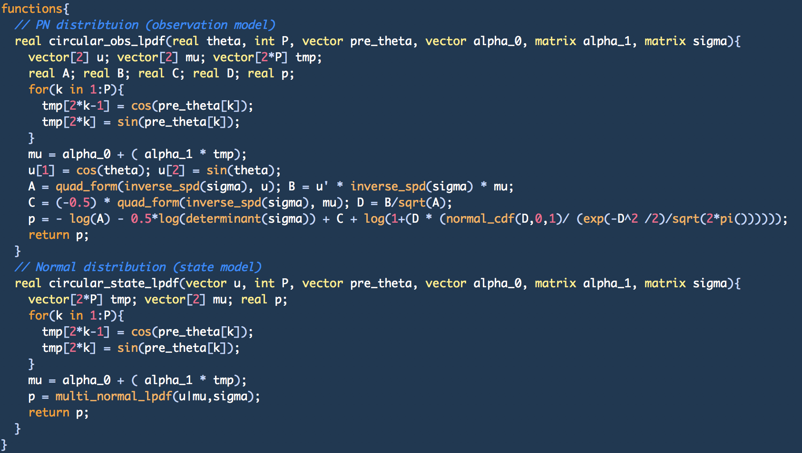
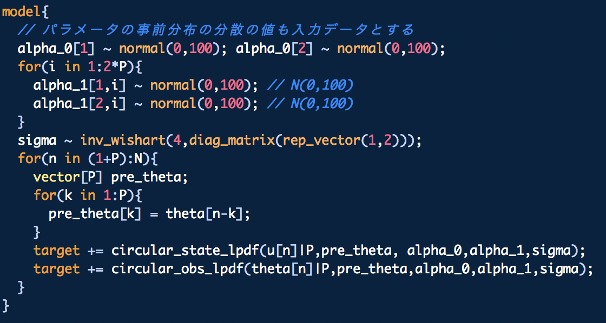

```{r knitr_init, echo=FALSE, cache=FALSE}
## Global options
#options(max.print="500")
rm(list = ls())
knitr:::opts_chunk$set(cache=TRUE,
               prompt=FALSE,
               tidy=TRUE,
               comment=NA,
               message=FALSE,
               warning=FALSE)
knitr:::opts_knit$set(width=75)
```

```{r echo=FALSE, cache=FALSE}
# set package
library(revealjs)
library(dplyr)
library(tidyverse)
library(tibble)
library(lubridate)
library(circular)
library(readr)
library(ggthemes)
library(ggforce)
library(MASS)
library(rstan)
library(MCMCpack)
library(loo)
library(ggmcmc)
library(tseries)
library(DT)
library(formattable)

# load function
source('~/Desktop/circular_reg/script/function.R') # 関数読み込み
# source('~/Desktop/circular_reg/script/stan_plot_label_helper.R')
# source('~/Desktop/circular_reg/script/misc.R')
.myfunc.env = new.env() # 関数をグローバル変数に表示しない
sys.source('~/Desktop/circular_reg/script/stan_plot_label_helper.R', envir = .myfunc.env) # stan_ac_labelに必要
sys.source('~/Desktop/circular_reg/script/misc.R', envir = .myfunc.env) # stan_ac_labelに必要
attach( .myfunc.env )
```

```{r echo=FALSE, cache=FALSE}
# set ggplot theme
library(ggplot2)
theme_set(theme_classic(base_size = 14,base_family = "Helvetica"))
```

# Table of content

## Table of content

1. Introduction

2. Circular Package and Circular statistics

3. Autoregressive model (AR model)

4. Apply the AR model on the Circular data

5. Make the Autoregressive model based on the Circular

6. Analysis for the wind direction data

# Introduction

## My profile

<div class="column1">
- Name: Takuto Kotsubo

- Twitter: [airspace_nobo](https://www.inosho.info/濃菜麺-井の庄/)

- Affiliation: Graduate School of Engineering

- Major: Time series analysis

- Hobby: Shogi, Bouldering

- Favorite `ggplot2` theme : **theme_classic**
</div>

<div class="column2">
```{r, echo=FALSE, out.width = '75%'}
knitr::include_graphics("data/ramen.png")

```
</div>

## Meeting circular statistics

```{r, echo=FALSE, out.width = '90%'}

```

## Why did I come here ? 

- Thorough my research, I will introduce you that various things can be done in **rstan** !!!!

<div class="column1">
```{r, echo=FALSE, out.width = '75%'}
knitr::include_graphics("data/ecosta1.png")
```
</div>

<div class="column2">
```{r, echo=FALSE, out.width = '75%'}
knitr::include_graphics("data/ecosta2.png")
```
</div>


# Circular Package and Circular statistics

## Circular Statistics

- Circular data refers to data recorded as points which directions are measured and arises in biology, geography, medicine, astronomy, and many other areas.
 
- The usual summary statistics, such as the mean and standard deviation, cannot be used with angular values.

```{r include=FALSE}
set.seed(831)
```

## Circular plot

- Use `circular` package

```{r fig.height=4}
x <- circular(data.frame(runif(100,0,pi/2))) 
par(mfcol = c(1,3))
plot(x,main = "Circular plot")
rose.diag(x,main = "rose diagrame")
hist(x %>% as.vector(), main = "Histogram",xlab=expression(theta))
```

## Circular plot

- Of course, `ggplot` can do it and more beautiful...

```{r, out.width = '50%'}
x <- data.frame(theta = runif(100,0,pi/2))
ggplot(x, aes(x =theta)) + 
  geom_histogram(bins = 50, fill = "steelblue") + 
  coord_polar(start = 0)  + scale_fill_brewer() + 
  scale_x_continuous("", limits = c(0, 2*pi), breaks = seq(0, 2*pi)) +
  theme_bw() + labs(title = "Circular histogram")
```

## Circular mean direction

- The average of the two radians $\pi/3$ and $\pi/5$ (black line)
- Arithmetic average is red line, circular mean direction is blue line

<div class="column3">
```{r fig.height=5, echo=FALSE}
y <- c(pi/3,pi*5/3)
plot(circular(y),shrink = 1,main="Circular mean direction")
arrows.circular(circular(y))
arrows.circular(circular(0),col=4,cex=100,lty=5)
arrows.circular(circular(pi),col=2,cex=100,lty=5)
```
</div>

<div class="column4">
```{r}
mean(y) 
mean.circular(y) 
```
</div>

## Circular Standard Deviation

- circular standard deviation is defined by $\sqrt{-2 \log(R)}$, $R$ means "mean resultant length"

<div class="column1">
```{r, echo=FALSE,  out.width = '100%'}

```
</div>

<div class="column2">
```{r}
# same data
x <- runif(1000,0,2*pi) 
# normal standard deviation
sd(x) 
# circular standard deviation
sd.circular(circular(x)) 
```
</div>

## Circular RMSE

- RMSE is a measure of the differences between observed values ($\theta_t$) and predicted values ($\hat{\theta_t}$) by the model,

$$\textrm{RMSE} = \sqrt{\frac{1}{n} \sum_{t=1}^n (\theta^{dif}_t)^2}, $$

where $\theta^{dif}_t$ consider the circular rotations, 

$$ 
\theta^{dif}_t = \begin{cases}
		\theta_t - \hat{\theta_t} + 2 \pi & (\theta_t - \hat{\theta_t}< - \pi) \\
		\theta_t - \hat{\theta_t} & (- \pi \leq \theta_t - \hat{\theta_t}\leq \pi) \\		
		\theta_t - \hat{\theta_t}- 2 \pi & (\theta_t - \hat{\theta_t}> \pi) 
	\end{cases}. 
$$

## Circular RMSE with plot

- Difference betweeen $\frac{11 \pi}{6}$ and $\frac{\pi}{3}$ is not $\frac{3\pi}{2}$ but **$\frac{\pi}{2}$** !!

```{r, echo=FALSE, out.width = '75%'}

```

## Circular test

- Rayleigh test : Whether the angle data is biased ...

- Kupier test : Whether angle data follow the von Mises distribution ...

- Mardia-Watoson-Wheeler test : Whether the angle data of the two groups follow the same distribution ...

# Autoregressive model (AR model)

## Autoregressive process 

- Autoregressive process means that the current data is represented by past data, AR($p$) model can be written as

$$y_t = c + \sum_{i=1}^p \phi_i y_{t-i} + \varepsilon_t,~~ \varepsilon_t \sim \mathcal{N}(0,~\sigma^2).$$

- Joint probability distribution can be written as follows, using value before the time point $t$

$$f(y_1, y_2, ...|c, \phi_i, \varepsilon) = \prod_{t=1+p}^{n}f(y_t|y_{t-1}, ...,y_{t-p},c, \phi_i, \varepsilon). $$

## Maximize log likelihood method

- From the time point $t-1$, the value at the time point $t$ as follows, 

$$ y_t|y_{t-1},...,y_{t-p} \sim \mathcal{N}(c + \sum_{i=1}^p \phi_i y_{t-i},~\sigma^2). $$

- Consider the log likelihoods at each time point

$$
\begin{eqnarray*}
\mathcal{L} &=& \log f(y_1, y_2, ...|c, \phi_i, \varepsilon) \\ 
&=& \log f(y_{1+p}|y_{p},...,y_{1}) + ... + \log f(y_{n}|y_{n-1},...,y_{n-p}).
\end{eqnarray*}
$$

## Parameter estimation method

- My rstan code (AR($p$) model)

```
data{
  int N; // data size
  int P; // AR(P) 
  vector[N] theta; // data set
}
parameters{
  real alpha_0; // const parameter
  row_vector[P] alpha_1; // coef parameter
  real<lower=0> sigma; // Variance 
}
model{
  alpha_0 ~ normal(0,100); sigma ~ normal(0,100);
  for(i in 1:P){
    alpha_1[i] ~ normal(0,100); // N(0,100)
  }
  for(n in (1+P):N){
    vector[P] pre_theta; 
    for(k in 1:P){
      pre_theta[k] = theta[n-k];
    }
    target += 
      normal_lpdf(theta[n]|alpha_0 + ( alpha_1 * pre_theta),sigma);
  }
}
generated quantities{
  vector[N-P] log_likelihood;
  for(n in (1+P):N){
    vector[P] pre_theta;
    for(k in 1:P){
      pre_theta[k] = theta[n-k];
    }
    log_likelihood[n-P] = 
      normal_lpdf(theta[n]|alpha_0 + ( alpha_1 * pre_theta),sigma);
  } 
}
```

## Sample data set

- The luteinzing hormone in blood (`lh` data set)
- 10 minutes interbals, 48 samples

```{r include=FALSE}
data(lh) # data import
```

```{r fig.height=3.5}
data.frame(lh) %>% 
    mutate(index = row_number()) %>%
    ggplot(aes(x=index,y=lh)) +
    geom_line()
```

## MCMC settings

- $1000$ warm up, $1000$ iteration, $4$ chains

```{r eval=FALSE}
rstan_options(auto_write=TRUE) # auto save
options(mc.cores=parallel::detectCores()) # multi core

ar2_model <- readRDS("model/circular_AR2.rds") # complie model
fit3 <- sampling(ar2_model,data = list(N=length(lh),P=3,theta=lh),
                 iter=2000, chains=4) # sampling by model
```

## Select AR($3$) model by WAIC

```{r,echo= FALSE,eval=FALSE}
# fit data 作成コード
ar2_model <- readRDS("model/circular_AR2.rds") 
rstan_options(auto_write=TRUE) # auto save
options(mc.cores=parallel::detectCores()) # multi core
fit1 <- sampling(ar2_model,data = list(N=length(lh),P=1,theta=lh), iter=2000, chains=4)
fit2 <- sampling(ar2_model,data = list(N=length(lh),P=2,theta=lh), iter=2000, chains=4)
fit3 <- sampling(ar2_model,data = list(N=length(lh),P=3,theta=lh), iter=2000, chains=4)
fit4 <- sampling(ar2_model,data = list(N=length(lh),P=4,theta=lh), iter=2000, chains=4)
fit5 <- sampling(ar2_model,data = list(N=length(lh),P=5,theta=lh), iter=2000, chains=4)
fit6 <- sampling(ar2_model,data = list(N=length(lh),P=6,theta=lh), iter=2000, chains=4)
fit7 <- sampling(ar2_model,data = list(N=length(lh),P=7,theta=lh), iter=2000, chains=4)

#### save fit model 
save(fit1, file="fit/AR_1.rda")# save fit
save(fit2, file="fit/AR_2.rda")# save fit
save(fit3, file="fit/AR_3.rda")# save fit
save(fit4, file="fit/AR_4.rda")# save fit
save(fit5, file="fit/AR_5.rda")# save fit
save(fit6, file="fit/AR_6.rda")# save fit
save(fit7, file="fit/AR_7.rda")# save fit

### load fit ###
load("fit/AR_1.rda", verbose = TRUE) 
load("fit/AR_2.rda", verbose = TRUE) 
load("fit/AR_3.rda", verbose = TRUE) 
load("fit/AR_4.rda", verbose = TRUE) 
load("fit/AR_5.rda", verbose = TRUE) 
load("fit/AR_6.rda", verbose = TRUE) 
load("fit/AR_7.rda", verbose = TRUE) 

### WAIC ####
extract_log_lik(fit1,"log_likelihood") %>% loo::waic() # VAR(1) model
extract_log_lik(fit2,"log_likelihood") %>% loo::waic() # VAR(2) model
extract_log_lik(fit3,"log_likelihood") %>% loo::waic() # VAR(3) model
extract_log_lik(fit4,"log_likelihood") %>% loo::waic() # VAR(4) model
extract_log_lik(fit5,"log_likelihood") %>% loo::waic() # VAR(5) model
extract_log_lik(fit6,"log_likelihood") %>% loo::waic() # VAR(6) model
extract_log_lik(fit7,"log_likelihood") %>% loo::waic() # VAR(7) model

### RMSE and plot ### 
pred_value(fit = fit1,p = 1,dat=as.vector(lh),who = 1)
pred_value(fit = fit2,p = 2,dat=as.vector(lh),who = 1)
pred_value(fit = fit3,p = 3,dat=as.vector(lh),who = 1)
pred_value(fit = fit4,p = 4,dat=as.vector(lh),who = 1)
pred_value(fit = fit5,p = 5,dat=as.vector(lh),who = 1)
pred_value(fit = fit6,p = 6,dat=as.vector(lh),who = 1)
pred_value(fit = fit7,p = 7,dat=as.vector(lh),who = 1)
```

- $\hat{R} < 1.01$ indicate all parameters convergence

<div class="column3">
```{r include=FALSE}
load("fit/AR_3.rda", verbose = TRUE) # load fit
```

```{r echo=FALSE}
pred <- ans_stan_p2(fit3, P=3, data=as.vector(lh))
data.frame(real=as.vector(lh),pred) %>% 
    mutate(index = row_number()) %>%
    ggplot(aes(x=index)) +
    # geom_ribbon(aes(ymin=lower,ymax=upper),fill="skyblue",alpha=0.6) +
    geom_line(aes(y=real, colour= "real")) + 
    geom_line(aes(y=predict, colour= "predict")) +
    scale_colour_manual("",
                        values = c("real"="black","predict"="blue")
    ) +
    labs(y=expression(theta))
```
</div>

<div class="column4">
<br>
```{r echo=FALSE}
data_frame(p = c(1,2,3,4,5,6,7),
           WAIC = c(64.6,63.8,63.7,65.2,66.4,65.4,65.4),
           RMSE = c(0.449,0.442,0.436,0.438,0.441,0.430,0.425)) %>% 
  formattable::formattable(list(WAIC = formatter("span",style = x ~ ifelse(x == min(x), style(color = "blue", font.weight = "bold"), NA)),
                                RMSE = formatter("span",style = x ~ ifelse(x == min(x), style(color = "blue", font.weight = "bold"), NA))))
```
</div>

## Autocorrelation of Markov Chains

```{r echo=FALSE,out.width = '85%'}
pars <- c("alpha_0","alpha_1[1]","alpha_1[2]","alpha_1[3]","sigma")
label_set <- list("alpha_0[1]" = expression(c),"alpha_1[1]" = expression(phi[1]), "alpha_1[2]" = expression(phi[2]),
                  "alpha_1[3]" = expression(phi[3]),"sigma" = expression(sigma))
label_func <- function(variable, value) return(label_set[value]) # label func
stan_ac_label(object=fit3,pars = pars,label_set = label_func) # stan_ac plot with arbitrary faaet_wrap label
```

## Posterior Distributions

```{r echo=FALSE,out.width = '85%'}
stan_plot(fit3,fill_color ="blue",point_est ="median",show_density=T, ci_level = 0.95, outer_level=1.00, show_outer_line =T,
          pars = c("alpha_0","alpha_1[1]","alpha_1[2]","alpha_1[3]","sigma")) + 
  scale_y_continuous(labels = rev(c(expression(c),expression(phi[1]),expression(phi[2]),expression(phi[3]),expression(sigma))), breaks = 1:5)
```

# Apply the Autoregressive model to the Circular data 

## Wind Direction in Col de la Roa

- In a place named "Col de la Roa" in the Italian Alps, It reported the wind direction records (`wind` data set)
- Total of 310 measures

```{r echo=FALSE,fig.height=4}
data(wind) 
wind_data <- wind %>%  
  data.frame(t = seq(1,310,1), tmp=.) %>% # put label
  mutate(theta_real = dplyr::if_else(tmp>pi,tmp - 2*pi, tmp)) %>% 
  dplyr::select(-tmp) %>% 
  mutate(cos_real = cos(theta_real), sin_real=sin(theta_real))

wind_data %>% 
  ggplot(aes(theta_real)) +
  geom_histogram(binwidth = 0.2, colour = "black", fill = "skyblue") + 
  labs(x="Wind directions in dadians")
```

## Preprovessing and MCMC settings

- change the domain of $\theta$ and make a data list for MCMC

```{r eval=FALSE}
data(wind) 
wind_data <- wind %>%  
  data.frame(t = seq(1,310,1), tmp=.) %>% # put label
  mutate(theta_real = dplyr::if_else(tmp>pi,tmp - 2*pi, tmp)) %>% 
  dplyr::select(-tmp) 
d.dat7 <- list(N=length(wind_data$theta_real), 
               P=7,theta=wind_data$theta_real) # data list
```

- $1000$ warm up, $1000$ iteration, $4$ chains

```{r eval=FALSE}
rstan_options(auto_write=TRUE) # auto save
options(mc.cores=parallel::detectCores()) # multi core

ar2_model <- readRDS("model/circular_AR2.rds") # complie model
fit_ar_7 <- sampling(ar_model,data = d.dat7, 
                     iter=2000, chains=4) # sampling by model
```

##  Select AR($7$) model by WAIC

- $\hat{R} < 1.01$ indicate all parameters convergence
- but fitting is wrong ...

```{r eval=FALSE,echo=FALSE}
# read model
ar_model <- readRDS("model/circular_AR.rds")
# fiting
rstan_options(auto_write=TRUE) # auto save
options(mc.cores=parallel::detectCores()) # multi core
fit_ar_1 <- sampling(ar_model,data = d.dat1, iter=2000, chains=4)
fit_ar_2 <- sampling(ar_model,data = d.dat2, iter=2000, chains=4)
fit_ar_3 <- sampling(ar_model,data = d.dat3, iter=2000, chains=4)
fit_ar_4 <- sampling(ar_model,data = d.dat4, iter=2000, chains=4)
fit_ar_5 <- sampling(ar_model,data = d.dat5, iter=2000, chains=4)
fit_ar_6 <- sampling(ar_model,data = d.dat6, iter=2000, chains=4)
fit_ar_7 <- sampling(ar_model,data = d.dat7, iter=2000, chains=4)
#fit_ar_8 <- sampling(ar_model,data = d.dat8, iter=2000, chains=4)
#fit_ar_9 <- sampling(ar_model,data = d.dat9, iter=2000, chains=4)
#fit_ar_10 <- sampling(ar_model,data = d.dat10, iter=2000, chains=4)

#### save fit model 
save(fit_ar_1, file="fit/CircularAR_1.rda")# save fit
save(fit_ar_2, file="fit/CircularAR_2.rda")# save fit
save(fit_ar_3, file="fit/CircularAR_3.rda")# save fit
save(fit_ar_4, file="fit/CircularAR_4.rda")# save fit
save(fit_ar_5, file="fit/CircularAR_5.rda")# save fit
save(fit_ar_6, file="fit/CircularAR_6.rda")# save fit
save(fit_ar_7, file="fit/CircularAR_7.rda")# save fit
#save(fit_ar_8, file="fit/CircularAR_8.rda")# save fit
#save(fit_ar_9, file="fit/CircularAR_9.rda")# save fit
#save(fit_ar_10, file="fit/CircularAR_10.rda")# save fit

### load fit ###
load("fit/CircularAR_1.rda", verbose = TRUE) 
load("fit/CircularAR_2.rda", verbose = TRUE) 
load("fit/CircularAR_3.rda", verbose = TRUE) 
load("fit/CircularAR_4.rda", verbose = TRUE) 
load("fit/CircularAR_5.rda", verbose = TRUE) 
load("fit/CircularAR_6.rda", verbose = TRUE) 
load("fit/CircularAR_7.rda", verbose = TRUE) 
#load("fit/CircularAR_8.rda", verbose = TRUE) 
#load("fit/CircularAR_9.rda", verbose = TRUE) 
#load("fit/CircularAR_10.rda", verbose = TRUE) 

### WAIC ####
extract_log_lik(fit_ar_1,"log_likelihood") %>% loo::waic() # VAR(1) model
extract_log_lik(fit_ar_2,"log_likelihood") %>% loo::waic() # VAR(2) model
extract_log_lik(fit_ar_3,"log_likelihood") %>% loo::waic() # VAR(3) model
extract_log_lik(fit_ar_4,"log_likelihood") %>% loo::waic() # VAR(4) model
extract_log_lik(fit_ar_5,"log_likelihood") %>% loo::waic() # VAR(5) model
extract_log_lik(fit_ar_6,"log_likelihood") %>% loo::waic() # VAR(6) model
extract_log_lik(fit_ar_7,"log_likelihood") %>% loo::waic() # VAR(7) model

### RMSE and plot ### 
pred_value(fit = fit_ar_1,p = 1,dat=wind_data$theta_real,who=1)
pred_value(fit = fit_ar_2,p = 2,dat=wind_data$theta_real,who=1)
pred_value(fit = fit_ar_3,p = 3,dat=wind_data$theta_real,who=1)
pred_value(fit = fit_ar_4,p = 4,dat=wind_data$theta_real,who=1)
pred_value(fit = fit_ar_5,p = 5,dat=wind_data$theta_real,who=1)
pred_value(fit = fit_ar_6,p = 6,dat=wind_data$theta_real,who=1)
pred_value(fit = fit_ar_7,p = 7,dat=wind_data$theta_real,who=1)
```

<div class="column3">
```{r include=FALSE}
load("fit/CircularAR_7.rda", verbose = TRUE) # load fit
```

```{r echo=FALSE}
pred <- ans_stan_p2(fit_ar_7, P=7, data=wind_data$theta_real)
data.frame(real=wind_data$theta_real,pred) %>% 
    mutate(index = row_number()) %>%
    ggplot(aes(x=index)) +
    # geom_ribbon(aes(ymin=lower,ymax=upper),fill="skyblue",alpha=0.6) +
    geom_line(aes(y=real, colour= "real")) + 
    geom_line(aes(y=predict, colour= "predict")) +
    scale_colour_manual("",
                        values = c("real"="black","predict"="blue")
    ) +
    labs(y=expression(theta))
```

</div>

<div class="column4">
<br>
```{r echo=FALSE}
data_frame(p = c(1,2,3,4,5,6,7),
           WAIC = c(890.1,888.2,888.8, 889.8,885.2,888.3,882.5),
           RMSE = c(0.993,0.987,0.989,0.989,0.984,0.980,0.979)) %>% 
  formattable::formattable(list(WAIC = formatter("span",style = x ~ ifelse(x == min(x), style(color = "blue", font.weight = "bold"), NA)),
                                RMSE = formatter("span",style = x ~ ifelse(x == min(x), style(color = "blue", font.weight = "bold"), NA))))
```
</div>

# Make the Autoregressive model based on the Circular 

## State-space model

```{r, echo=FALSE, out.width = '100%'}

```

$$\mu_t = \left(
  \begin{array}{c}
    \cos \theta_t \\
    \sin \theta_t
  \end{array}
\right), ~~ \theta_t \sim \mathcal{PN}(\mu_t, \sum)$$

## $\mathcal{PN}$ distribution

- **If rstan, you can decsribe a complex distribution**

```{r, echo=FALSE, out.width = '140%'}

```

## Circular State-space model

$$
\left(
  \begin{array}{c}
    \cos \theta_t \\
    \sin \theta_t
  \end{array}
\right) =
\left(
  \begin{array}{c}
    \alpha_{c,0} \\
    \alpha_{s,0}
  \end{array} 
\right) +
\left(
  \begin{array}{cc}
    \beta_{c,1,1} & \beta_{c,1,2} \\
    \beta_{s,1,1} & \beta_{s,1,2}
  \end{array}
\right)
\left(
  \begin{array}{c}
    \cos \theta_{t-1} \\
    \sin \theta_{t-1}
  \end{array} 
\right) \\ +
\left(
  \begin{array}{cc}
    \beta_{c,2,1} & \beta_{c,2,2} \\
    \beta_{s,2,1} & \beta_{s,2,2}
  \end{array} 
\right)
\left(
  \begin{array}{c}
    \cos \theta_{t-2} \\
    \sin \theta_{t-2}
  \end{array} 
\right) + \cdots + \\ 
\left(
  \begin{array}{cc}
    \beta_{c,p,1} & \beta_{c,p,2} \\
    \beta_{s,p,1} & \beta_{s,p,2}
  \end{array}
\right)
\left(
  \begin{array}{c}
    \cos \theta_{t-p} \\
    \sin \theta_{t-p}
  \end{array} 
\right) +
\left(  
  \begin{array}{c}
    \varepsilon_{c,t} \\
    \varepsilon_{s,t}
  \end{array}
\right)
$$ 

where $\boldsymbol{\alpha}, \boldsymbol{\beta}$ is coefficient parameters and $\boldsymbol{\varepsilon}$ is variance parameter.

$$
\left(
  \begin{array}{c}
    \varepsilon_{c,t} \\
    \varepsilon_{s,t}
  \end{array} 
\right) \sim 
N 
\left(
  \left(
    \begin{array}{c}
      0 \\
      0
    \end{array}
  \right),
  \left(
    \begin{array}{cc}
      \sigma_c^2 & \rho \sigma_c \sigma_s \\
      \rho \sigma_c \sigma_s & \sigma_s^2
    \end{array}
  \right)
\right)
$$

## Circular State-space model

<div class="back1">
$$
\left(
  \begin{array}{c}
    \cos \theta_t \\
    \sin \theta_t
  \end{array}
\right) =
\left(
  \begin{array}{c}
    \alpha_{c,0} \\
    \alpha_{s,0}
  \end{array} 
\right) +
\left(
  \begin{array}{cc}
    \beta_{c,1,1} & \beta_{c,1,2} \\
    \beta_{s,1,1} & \beta_{s,1,2}
  \end{array}
\right)
\left(
  \begin{array}{c}
    \cos \theta_{t-1} \\
    \sin \theta_{t-1}
  \end{array} 
\right) \\ +
\left(
  \begin{array}{cc}
    \beta_{c,2,1} & \beta_{c,2,2} \\
    \beta_{s,2,1} & \beta_{s,2,2}
  \end{array} 
\right)
\left(
  \begin{array}{c}
    \cos \theta_{t-2} \\
    \sin \theta_{t-2}
  \end{array} 
\right) + \cdots + \\ 
\left(
  \begin{array}{cc}
    \beta_{c,p,1} & \beta_{c,p,2} \\
    \beta_{s,p,1} & \beta_{s,p,2}
  \end{array}
\right)
\left(
  \begin{array}{c}
    \cos \theta_{t-p} \\
    \sin \theta_{t-p}
  \end{array} 
\right) +
\left(  
  \begin{array}{c}
    \varepsilon_{c,t} \\
    \varepsilon_{s,t}
  \end{array}
\right)
$$ 

where $\boldsymbol{\alpha}, \boldsymbol{\beta}$ is coefficient parameters and $\boldsymbol{\varepsilon}$ is variance parameter.

$$
\left(
  \begin{array}{c}
    \varepsilon_{c,t} \\
    \varepsilon_{s,t}
  \end{array} 
\right) \sim 
N 
\left(
  \left(
    \begin{array}{c}
      0 \\
      0
    \end{array}
  \right),
  \left(
    \begin{array}{cc}
      \sigma_c^2 & \rho \sigma_c \sigma_s \\
      \rho \sigma_c \sigma_s & \sigma_s^2
    \end{array}
  \right)
\right)
$$
</div>

## Circular State-space model

- **Easy to write using rstan**

```{r, echo=FALSE, out.width = '100%'}

```

## MCMC code for Circular State-space model 

```
functions{
    // PN distribution (observation model)
  real circular_obs_lpdf(real theta, int P, vector pre_theta, vector alpha_0, matrix alpha_1, matrix sigma){
    vector[2] u; vector[2] mu; vector[2*P] tmp; real A; real B; real C; real D; real p;
    for(k in 1:P){
      tmp[2*k-1] = cos(pre_theta[k]); tmp[2*k] = sin(pre_theta[k]);
    }
    mu = alpha_0 + ( alpha_1 * tmp); u[1] = cos(theta); u[2] = sin(theta);
    A = quad_form(inverse_spd(sigma), u); B = u' * inverse_spd(sigma) * mu;
    C = (-0.5) * quad_form(inverse_spd(sigma), mu); D = B/sqrt(A);
    p = - log(A) - 0.5*log(determinant(sigma)) + C + log(1+(D * (normal_cdf(D,0,1)/ (exp(-D^2 /2)/sqrt(2*pi()))))); 
    return p;
  }
  // Multi Normal distribution (state model)
  real circular_state_lpdf(vector u, int P, vector pre_theta, vector alpha_0, matrix alpha_1, matrix sigma){
    vector[2*P] tmp; vector[2] mu; real p;
    for(k in 1:P){
      tmp[2*k-1] = cos(pre_theta[k]); tmp[2*k] = sin(pre_theta[k]);
    }
    mu = alpha_0 + ( alpha_1 * tmp); 
    p = multi_normal_lpdf(u|mu,sigma);
    return p;
  }
}

data{
  // data paramter
  int N; // sample size
  int P; // VAR(P) 
  vector<lower=-pi(),upper=pi()>[N] theta; // data
}

transformed data{
  vector[2] u[N];
  for(k in 1:N){
    u[k,1] = cos(theta[k]);
    u[k,2] = sin(theta[k]);
  }
}

parameters{
  vector[2] alpha_0;
  matrix[2,2*P] alpha_1;
  cov_matrix[2] sigma;
}

model{
  alpha_0[1] ~ normal(0,100); alpha_0[2] ~ normal(0,100);
  for(i in 1:2*P){
    alpha_1[1,i] ~ normal(0,100); // N(0,100)
    alpha_1[2,i] ~ normal(0,100); // N(0,100)
  }
  sigma ~ inv_wishart(4,diag_matrix(rep_vector(1,2)));
  for(n in (1+P):N){
    vector[P] pre_theta;
    for(k in 1:P){
      pre_theta[k] = theta[n-k];
    }
    target += circular_state_lpdf(u[n]|P,pre_theta, alpha_0,alpha_1,sigma);
    target += circular_obs_lpdf(theta[n]|P,pre_theta,alpha_0,alpha_1,sigma);
  }
}

generated quantities{
  vector[N-P] log_likelihood;
  for(n in (1+P):N){
    vector[P] pre_theta;
    for(k in 1:P){
      pre_theta[k] = theta[n-k];
    }
    log_likelihood[n-P] = circular_state_lpdf(u[n]|P,pre_theta, alpha_0,alpha_1,sigma) + 
                          circular_obs_lpdf(theta[n]|P, pre_theta, alpha_0, alpha_1, sigma);
  } 
}

```

# Analysis for the wind direction data

## Wind Direction in Col de la Roa

- In a place named "Col de la Roa" in the Italian Alps, It reported the wind direction records (`wind` data set)
- Total of 310 measures

```{r echo=FALSE,fig.height=4}
data(wind) 
wind_data <- wind %>%  
  data.frame(t = seq(1,310,1), tmp=.) %>% # put label
  mutate(theta_real = dplyr::if_else(tmp>pi,tmp - 2*pi, tmp)) %>% 
  dplyr::select(-tmp) %>% 
  mutate(cos_real = cos(theta_real), sin_real=sin(theta_real))

wind_data %>% 
  ggplot(aes(theta_real)) +
  geom_histogram(binwidth = 0.2, colour = "black", fill = "skyblue") + 
  labs(x="Wind directions in dadians")
```

```{r include=FALSE}
# stan paramter set
d.dat1 <- list(N=length(wind_data$theta_real),P=1,theta=wind_data$theta_real) # for VAR(1)
d.dat2 <- list(N=length(wind_data$theta_real),P=2,theta=wind_data$theta_real) # for VAR(2)
d.dat3 <- list(N=length(wind_data$theta_real),P=3,theta=wind_data$theta_real) # for VAR(3)
d.dat4 <- list(N=length(wind_data$theta_real),P=4,theta=wind_data$theta_real) # for VAR(4)
d.dat5 <- list(N=length(wind_data$theta_real),P=5,theta=wind_data$theta_real) # for VAR(5)
d.dat6 <- list(N=length(wind_data$theta_real),P=6,theta=wind_data$theta_real) # for VAR(6)
d.dat7 <- list(N=length(wind_data$theta_real),P=7,theta=wind_data$theta_real) # for VAR(7)
d.dat8 <- list(N=length(wind_data$theta_real),P=8,theta=wind_data$theta_real) # for VAR(8)
d.dat9 <- list(N=length(wind_data$theta_real),P=9,theta=wind_data$theta_real) # for VAR(9)
d.dat10 <- list(N=length(wind_data$theta_real),P=10,theta=wind_data$theta_real) # for VAR(10)
```

## Preprovessing and MCMC settings

- change the domain of $\theta$ and make a data list for MCMC

```{r eval=FALSE}
data(wind) 
wind_data <- wind %>%  
  data.frame(t = seq(1,310,1), tmp=.) %>% # put label
  mutate(theta_real = dplyr::if_else(tmp>pi,tmp - 2*pi, tmp)) %>% 
  dplyr::select(-tmp) 
d.dat5 <- list(N=length(wind_data$theta_real),
               P=5,theta=wind_data$theta_real) # data list
```

- $1000$ warm up, $4000$ iteration, $4$ chains

```{r eval=FALSE}
rstan_options(auto_write=TRUE) # auto save
options(mc.cores=parallel::detectCores()) # multi core

state_obs_model <- readRDS("model/state_obs_circular_VAR.rds") # complie model
fit_state_obs_5 <- sampling(state_obs_model,data = d.dat5, 
                            iter=5000, chains=4) # sampling by model
```

## Autocorrelation of Markov Chains

```{r include=FALSE}
load("fit/CircularVAR_5.rda", verbose = TRUE) # load fit
```

```{r echo=FALSE,out.width = '85%'}
pars <- c("alpha_0[1]","alpha_0[2]","alpha_1[1,1]","alpha_1[1,2]","alpha_1[2,1]","alpha_1[2,2]","alpha_1[1,3]","alpha_1[1,4]","alpha_1[2,3]","alpha_1[2,4]")
label_set <- list("alpha_0[1]" = expression(alpha[paste("c,",0)]),"alpha_0[2]" = expression(alpha[paste("s,",0)]),"alpha_1[1,1]" = expression(beta[paste("c,",1,",",1)]), 
                  "alpha_1[1,2]" = expression(beta[paste("c,",1,",",2)]),"alpha_1[2,1]" = expression(beta[paste("s,",1,",",1)]),"alpha_1[2,2]" = expression(beta[paste("s,",1,",",2)]),
                  "alpha_1[1,3]" = expression(beta[paste("c,",2,",",1)]),"alpha_1[1,4]" = expression(beta[paste("c,",2,",",2)]),"alpha_1[2,3]" = expression(beta[paste("s,",2,",",1)]),
                  "alpha_1[2,4]" = expression(beta[paste("s,",2,",",2)]))
label_func <- function(variable, value) return(label_set[value]) # label func
stan_ac_label(object=fit_state_obs_5,pars = pars,label_set = label_func) # stan_ac plot with arbitrary faaet_wrap label
```

## Posterior Distributions

```{r echo=FALSE,out.width = '85%'}
stan_plot(fit_state_obs_5,fill_color ="blue",point_est ="median",show_density=T, ci_level = 0.95, outer_level=1.00, show_outer_line =T,
          pars = c("alpha_0[1]","alpha_0[2]","alpha_1[1,1]","alpha_1[1,2]","alpha_1[2,1]","alpha_1[2,2]","alpha_1[1,3]","alpha_1[1,4]","alpha_1[2,3]","alpha_1[2,4]")) + 
  scale_y_continuous(labels = rev(c(expression(alpha[paste("c,",0)]),expression(alpha[paste("s,",0)]),expression(beta[paste("c,",1,",",1)]), 
                                    expression(beta[paste("c,",1,",",2)]),expression(beta[paste("s,",1,",",1)]),expression(beta[paste("s,",1,",",2)]),
                                    expression(beta[paste("c,",2,",",1)]),expression(beta[paste("c,",2,",",2)]),expression(beta[paste("s,",2,",",1)]),
                                    expression(beta[paste("s,",2,",",2)]))), breaks = 1:10)
```

##  Select Circular State-space model($5$) model by WAIC

- $\hat{R} < 1.01$ indicate all parameters convergence

```{r eval=FALSE,echo=FALSE}
# read model
state_obs_model <- readRDS("model/state_obs_circular_VAR.rds")

# fiting
rstan_options(auto_write=TRUE) # auto save
options(mc.cores=parallel::detectCores()) # multi core
fit_state_obs_1 <- sampling(state_obs_model,data = d.dat1, iter=5000, chains=4)
fit_state_obs_2 <- sampling(state_obs_model,data = d.dat2, iter=5000, chains=4)
fit_state_obs_3 <- sampling(state_obs_model,data = d.dat3, iter=5000, chains=4)
fit_state_obs_4 <- sampling(state_obs_model,data = d.dat4, iter=5000, chains=4)
fit_state_obs_5 <- sampling(state_obs_model,data = d.dat5, iter=5000, chains=4)
fit_state_obs_6 <- sampling(state_obs_model,data = d.dat6, iter=5000, chains=4)
fit_state_obs_7 <- sampling(state_obs_model,data = d.dat7, iter=5000, chains=4)
fit_state_obs_8 <- sampling(state_obs_model,data = d.dat8, iter=5000, chains=4)
fit_state_obs_9 <- sampling(state_obs_model,data = d.dat9, iter=5000, chains=4)
fit_state_obs_10 <- sampling(state_obs_model,data = d.dat10, iter=5000, chains=4)

#### save fit model 
save(fit_state_obs_1, file="fit/CircularVAR_1.rda")# save fit
save(fit_state_obs_2, file="fit/CircularVAR_2.rda")# save fit
save(fit_state_obs_3, file="fit/CircularVAR_3.rda")# save fit
save(fit_state_obs_4, file="fit/CircularVAR_4.rda")# save fit
save(fit_state_obs_5, file="fit/CircularVAR_5.rda")# save fit
save(fit_state_obs_6, file="fit/CircularVAR_6.rda")# save fit
save(fit_state_obs_7, file="fit/CircularVAR_7.rda")# save fit
save(fit_state_obs_8, file="fit/CircularVAR_8.rda")# save fit
save(fit_state_obs_9, file="fit/CircularVAR_9.rda")# save fit
save(fit_state_obs_10, file="fit/CircularVAR_10.rda")# save fit

### load fit ###
load("fit/CircularVAR_1.rda", verbose = TRUE) 
load("fit/CircularVAR_2.rda", verbose = TRUE) 
load("fit/CircularVAR_3.rda", verbose = TRUE) 
load("fit/CircularVAR_4.rda", verbose = TRUE) 
load("fit/CircularVAR_5.rda", verbose = TRUE) 
load("fit/CircularVAR_6.rda", verbose = TRUE) 
load("fit/CircularVAR_7.rda", verbose = TRUE) 
load("fit/CircularVAR_8.rda", verbose = TRUE) 
load("fit/CircularVAR_9.rda", verbose = TRUE) 
load("fit/CircularVAR_10.rda", verbose = TRUE) 

### WAIC ####
extract_log_lik(fit_state_obs_1,"log_likelihood") %>% loo::waic() # VAR(1) model
extract_log_lik(fit_state_obs_2,"log_likelihood") %>% loo::waic() # VAR(2) model
extract_log_lik(fit_state_obs_3,"log_likelihood") %>% loo::waic() # VAR(3) model
extract_log_lik(fit_state_obs_4,"log_likelihood") %>% loo::waic() # VAR(4) model
extract_log_lik(fit_state_obs_5,"log_likelihood") %>% loo::waic() # VAR(5) model
extract_log_lik(fit_state_obs_6,"log_likelihood") %>% loo::waic() # VAR(6) model
extract_log_lik(fit_state_obs_7,"log_likelihood") %>% loo::waic() # VAR(7) model
extract_log_lik(fit_state_obs_8,"log_likelihood") %>% loo::waic() # VAR(8) model
extract_log_lik(fit_state_obs_9,"log_likelihood") %>% loo::waic() # VAR(9) model
extract_log_lik(fit_state_obs_10,"log_likelihood") %>% loo::waic() # VAR(10) model

### RMSE and plot ### 
pred_value(fit = fit_state_obs_1,p = 1,dat=wind_data$theta_real)
pred_value(fit = fit_state_obs_2,p = 2,dat=wind_data$theta_real)
pred_value(fit = fit_state_obs_3,p = 3,dat=wind_data$theta_real)
pred_value(fit = fit_state_obs_4,p = 4,dat=wind_data$theta_real)
pred_value(fit = fit_state_obs_5,p = 5,dat=wind_data$theta_real)
pred_value(fit = fit_state_obs_6,p = 6,dat=wind_data$theta_real)
pred_value(fit = fit_state_obs_7,p = 7,dat=wind_data$theta_real)
pred_value(fit = fit_state_obs_8,p = 8,dat=wind_data$theta_real)
pred_value(fit = fit_state_obs_9,p = 9,dat=wind_data$theta_real)
pred_value(fit = fit_state_obs_10,p = 10,dat=wind_data$theta_real)
```

<div class="column3">
```{r echo=FALSE}
pred_value(fit = fit_state_obs_5,p = 5,dat=wind_data$theta_real,dif = FALSE)
```
</div>

<div class="column4">
```{r echo=FALSE}
data_frame(p = c(1,2,3,4,5,6,7,8,9,10),
           WAIC = c(444.2,442.5,435.0,436.6,431.9,437.4,449.6,456.4,466.6,461.3),
           RMSE = c(0.915,0.902,0.908,0.899,0.892,0.884,0.886,0.885,0.886,0.882)) %>% 
   formattable::formattable(list(WAIC = formatter("span",style = x ~ ifelse(x == min(x), style(color = "blue", font.weight = "bold"), NA)),
                                 RMSE = formatter("span",style = x ~ ifelse(x == min(x), style(color = "blue", font.weight = "bold"), NA))))
```
</div>

## Off Topic

- `rstan` uses `ggplot2`, so you change the option easily

```{r eval=FALSE}
stan_plot(
  fit_state_obs_5,fill_color ="blue",point_est ="median",show_density=T, 
  ci_level = 0.95, outer_level=1.00, show_outer_line =T,
  pars = c("alpha_0[1]","alpha_0[2]","alpha_1[1,1]","alpha_1[1,2]",
            "alpha_1[2,1]","alpha_1[2,2]","alpha_1[1,3]",
            "alpha_1[1,4]","alpha_1[2,3]","alpha_1[2,4]")) + 
  scale_y_continuous(
    labels= c(expression(alpha[paste("c,",0)]),expression(alpha[paste("s,",0)]),
              expression(beta[paste("c,",1,",",1)]),expression(beta[paste("c,",1,",",2)]),
              expression(beta[paste("s,",1,",",1)]),expression(beta[paste("s,",1,",",2)]),
              expression(beta[paste("c,",2,",",1)]),expression(beta[paste("c,",2,",",2)]),
              expression(beta[paste("s,",2,",",1)]),expression(beta[paste("s,",2,",",2)])) %>% 
      rev(), breaks = 1:10) 
```

## Summary

<div class="text1">

- Amazing *ggplot2* !! 

- Fantastic *facet_zoom* !!

- Useful *reveal.js* !!

</div>

## 

<div class="text1">
**Thank you for listening !!**

**Enjoy!**
</div>

# Appendix

## Model Selection Criteria (WAIC)

- WAIC can be viewed as an improvement on the DIC for Bayesian models. WAIC can be interpreted as a computationally convenient approximation to cross-validation and is defined as

```{r, echo=FALSE, out.width = '90%'}
knitr::include_graphics("data/WAIC.eps")
```

where $n$ is the number of data $\theta$, $S$ is MCMC sampling number of each parameter, $\eta^{m, S}$ is the $S$-th parameter set of the $m$-th chain.

## Projected Normal Distribution

- Distributions of the circle can be obtained by radial projection of distributions on the plane.
- The density of $\Theta$ in $U = (\cos\Theta, \sin\Theta)^T$ can be represented as 

$$
\begin{eqnarray*}
p(\theta|\mu, \Sigma) = \frac{1}{2\pi A(\theta)} |\Sigma|^{-\frac{1}{2}}
\exp(C)\left\{1 + \frac{B(\theta)}{\sqrt{A(\theta)}} \frac{\Phi \left(\frac{B(\theta)}{\sqrt{A(\theta)}}\right)}{\varphi \left(\frac{B(\theta)}{\sqrt{A(\theta)}}\right)}\right\},
\end{eqnarray*}
$$

where $u^T = (\cos\theta,\sin\theta), A(\theta) =  u^T\Sigma^{-1} u, \ B(\theta) =  u^T \Sigma^{-1} \mu$ and $\ C = -\frac{1}{2} \mu^T \Sigma^{-1} \mu$. $\Phi(\cdot), \varphi(\cdot)$ are the standard normal distribution and density functions.

